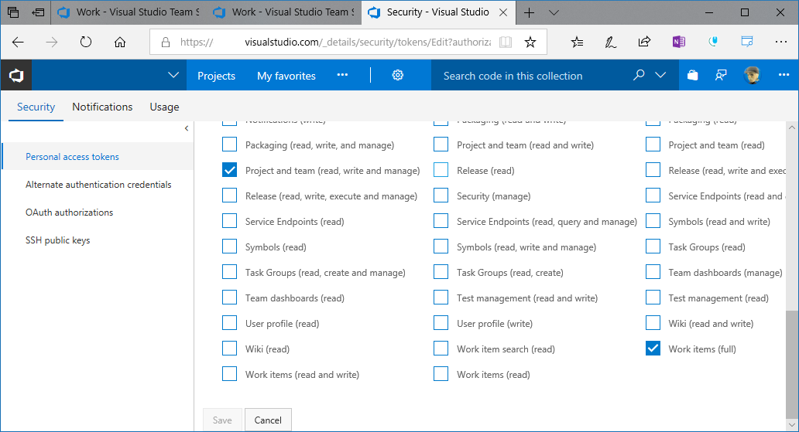
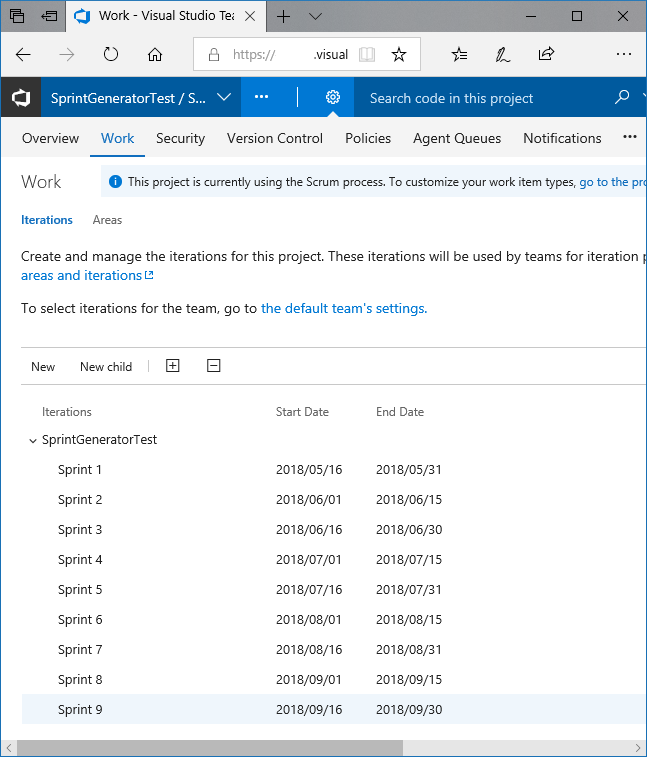
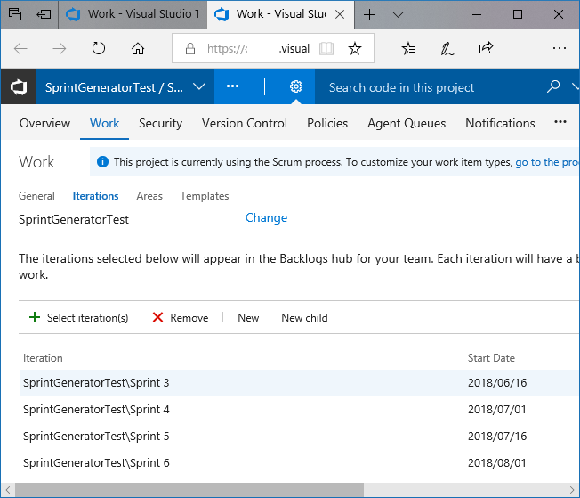
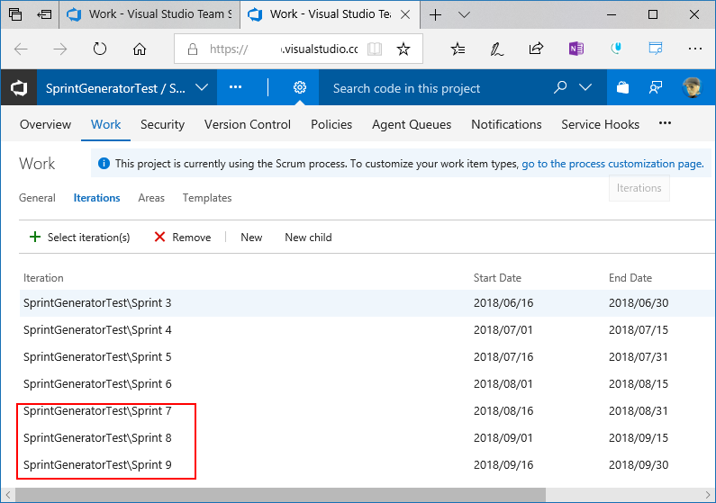

# SprintGenerator
Sprint Generator for VSTS/TFS. This tool's goal is automatically configure Sprint Calendar. 

## Notice 
Currently Project admin's API is not public. This tool only sync from Project Iteration to Team Iteration now.

## Prequirement 
- Visual Studio Team Services
- .NET Framework 4.6.2

## Installing
- copy any folder

## How to use
1. Get your PAT grant to "Project and team(read, write and manage)", "Work items(full)"  
   [Authenticate access with personal access tokens for VSTS and TFS](https://docs.microsoft.com/en-us/vsts/accounts/use-personal-access-tokens-to-authenticate?view=vsts)
   
1. Configure your Project Iteration
   https://{youraccount}.visualstudio.com/{yourproject}/_admin/_work
   
1. check your team Iteration setting, and recode to hope to start sprint index.
   
   https://{your account}.visualstudio.com/{your project}/{your team}/_admin/_work?_a=iterations
   In this case, "Sprint 7" is not apply in team's sprint.
1. execute this tool  
   `SprintGenerator -PAT {PAT} -url https://{account}.visualstudio.com/ -Project {Project Name} -t {Team Name} -i {sprint index} -f {Sprint Prefix Name}`
1. after that, sync from "Project Iteration" to "Team Iteration"  
   add "Sprint 7", "Sprint 8", "Sprint 9" in Team Iteration.
   

## Command Line Option

These options must to require.

| option | detail |
|:-----------|:-----------|
|PAT|Personal Access Token for this tool, must require **"Project and team(read, write and manage)"** and **"Work items(full)"**  |
|URL|your VSTS url(**https://{youraccount}.visualstudio.com**)|
|Project or p|Project Name. If include blank in Project name, quote project name. "Project Name"|
|Team or t|your Team Name. if include blank in Team name, quote Team name. "Team Name"  |
|Index or i|You want to start syncing sprint index. If you hope to start "Sprint 7", you must input "-i 7"|
|SprintPrefix or f|Sprint prefix name, ex:"Sprint 6" in Project Sprint, you must require "Sprint".|

## Notice
These unit tests skip to execute in Visual Studio 2017(15.7.1). 

## Future Plan
1. Support Team Foundation Server(TFS 2015 later)
1. Support other authentication(Oauth, NTLM)
1. Support hierarchy format in sprint(ex:ProjectName/foo/SprintName xx)
1. Support configure to Project Iteration automatically(If admin's API to be public).
1. move to .NET Core(via REST API).

